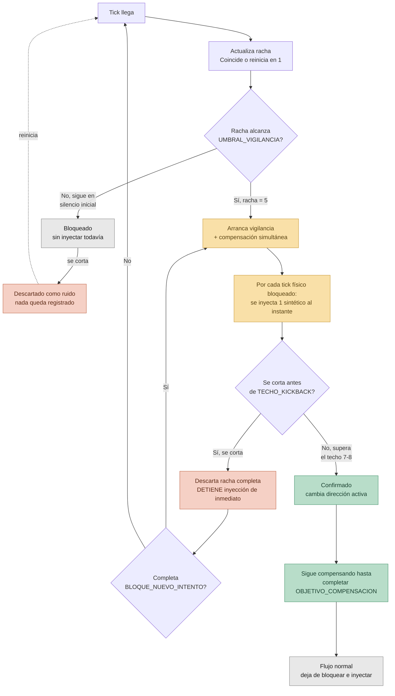

# wheel-fix — Diseño v2: Detección anidada + compensación por inyección

**Fecha del diseño:** 2026-08-26 (corregido — ver Nota de corrección)
**Estado:** IMPLEMENTADO en Go (2026-09-10), con simplificaciones — ver la sección
siguiente. Las secciones 1-8 son el diseño original y su razonamiento; el
comportamiento real es el de "Estado de implementación".

---

## Estado de implementación (2026-09-10)

### Qué es y cómo se corre

- **Todo el código es Go.** No queda nada de Rust (la v1 y este diseño se
  escribieron primero en Rust; se reescribió el proyecto entero a Go como
  ejercicio de aprendizaje).
- **No es un ejecutable distribuible todavía.** No hay instalador, GUI, ícono
  de bandeja ni autostart — eso es el roadmap.
- Se compila desde el código fuente y se corre en una terminal:
  `go run .` — **sin permisos de administrador**.
- Módulos (SOM en Go): `src/filter/core.go` (orquestador) + `src/filter/internal/`
  (`detection.go` = hook + máquina de decisión, `injector.go` = goroutine
  inyectora) + `src/helpers/constants.go` + `src/config/config.go` (`silence`
  /`trust` `atomic.Int32` + `enabled` `atomic.Bool`, ajustables en caliente) +
  `src/server/` (`core.go` = `StartServer`, `config_api.go` = API HTTP local) +
  `src/exception/` (micro-lib try/catch). Win32 a mano vía `syscall` +
  `golang.org/x/sys/windows`.
- `main.go` arranca `server.StartServer()` (goroutine) y luego `filter.Run()`.
- Trace de fases detrás de la env var `KICKBACK_DEBUG`; sin ella, silencio.

### El filtro implementado

Ajustable en caliente por la API HTTP local (`127.0.0.1:47800`, `GET`/`PUT
/config` con `{"silence","trust","enabled"}`) sin recompilar. Por defecto en
`helpers/constants.go`; rangos válidos (sliders) en `server/config_api.go`:

| Campo    | Valor    | Rol                                                                     |
| -------- | -------- | ---------------------------------------------------------------------- |
| `silence`| 3 (2-5)  | ticks bloqueados en silencio antes de arrancar la compensación         |
| `trust`  | 7 (6-10) | racha total a la que la dirección se da por confirmada; el tick 8+ pasa |
| `enabled`| `true`   | con `false` el hook deja pasar todo tick sin tocarlo (on/off de la GUI) |

- **Racha** (`updateStreak`): cuenta ticks consecutivos en la misma dirección
  comparando con **el tick anterior** — no con una "dirección confirmada", no
  hay pase libre para nadie. Cualquier tick en dirección distinta la reinicia
  a 1. Capeada en `TRUST_TICKS + 1` (no desborda nunca; más allá de ahí el
  valor da igual).
- **`decide(racha)`** — sin máquina de estados; todo se deriva de la racha:
  - `racha ≤ SILENCE_TICKS` → bloquea en silencio, no inyecta
  - `SILENCE_TICKS < racha ≤ TRUST_TICKS` → bloquea el físico **+ inyecta 1
    sintético** en esa dirección
  - `racha > TRUST_TICKS` → pasa (dirección confirmada, flujo normal)
- Por gesto: 7 físicos bloqueados (3 silencio + 4 compensados), 4 sintéticos
  inyectados.
- Un evento inyectado por nosotros (`SELF_INJECTED` / `LLMHF_INJECTED` en
  `MSLLHOOKSTRUCT.flags`) se deja pasar sin re-procesar, o el hook se dispara
  a sí mismo en bucle.
- La inyección corre en una **goroutine aparte** (canal); nunca `SendInput`
  dentro del callback del hook — eso deadlockea el raw input thread (BUG 6).

### Simplificaciones respecto al diseño de abajo

- Un solo umbral de silencio (`SILENCE_TICKS`), no `UMBRAL_DESCARTE` +
  `UMBRAL_VIGILANCIA`. El "5" del `UMBRAL_VIGILANCIA` nunca se usó; el silencio
  es de 3 (coincide con la Nota de corrección, no con la sección 4).
- No hay `BLOQUE_NUEVO_INTENTO` como estado aparte — tras un corte la racha
  simplemente reinicia y vuelve a pasar por los mismos 3 ticks de silencio.
- `TECHO_KICKBACK` y `OBJETIVO_COMPENSACION` son **un solo número**
  (`TRUST_TICKS = 7`), no dos.
- No existen estados `Vigilancia` / `Compensando` distintos — son rangos de la
  racha dentro de `decide`.
- La confirmación no es una acción: es simplemente "la racha pasó
  `TRUST_TICKS`".

### Validación

**El kickback del encoder se resolvió en hardware** (firmware vía Armoury
Crate + limpieza + swap de switches) antes de poder validar v2 contra kickback
real. El filtro compila, pasa los tests y corre idéntico al diseño, pero no
hay señal de kickback para medir su efecto en producción.

---

## Nota de corrección (2026-08-26)

La versión anterior de este documento (24 de agosto) describía la
compensación como una ráfaga que se inyecta **después** de completar la
confirmación — es decir, primero se bloquean todos los ticks necesarios en
silencio, y solo al final se inyecta todo de golpe.

Eso es incorrecto respecto a la intención real del diseño. La compensación
**no es una ráfaga posterior — es simultánea al bloqueo**. Desde el momento
en que un candidato pasa el filtro mínimo (`BLOQUE_NUEVO_INTENTO`, 2-3
ticks), cada tick físico que se bloquea a partir de ahí se acompaña, en el
mismo instante, de un tick sintético inyectado.

Ejemplo concreto del comportamiento correcto:

```
tick 1: bloqueado                          (sin inyección todavía)
tick 2: bloqueado                          (sin inyección todavía)
tick 3: bloqueado, pasa el filtro mínimo   -> entra en "vigilancia"
tick 4: se bloquea el físico + se inyecta un tick artificial
tick 5: se bloquea el físico + se inyecta un tick artificial
tick 6: se bloquea el físico + se inyecta un tick artificial
tick 7: se bloquea el físico + se inyecta un tick artificial
tick 8: se deja de bloquear el físico, se deja de inyectar — flujo normal
```

---

## 1. Problema que resuelve

El esquema v1 (ya implementado, ver `Bugs_Documentados.md` BUG 5: esquema
`LAST_DIR` + `STREAK_COUNT`, sin pase libre para ninguna dirección) bloquea
correctamente el kickback, pero tiene un costo directo: cualquier cambio de
dirección real queda retenido sin pasar a pantalla hasta acumular N ticks
reales consecutivos (actualmente `REQUIRED_CONFIRMATIONS = 6`).

Mientras se espera la confirmación, el usuario no ve ningún movimiento en
pantalla — la sensación es de que el mouse "no respondió" durante varios
ticks antes de que el scroll arranque.

Las heurísticas basadas en tiempo (elapsed desde el tick anterior) se
descartaron: logs reales muestran cambios de dirección genuinos con elapsed
tan bajo como 33-49ms, dentro del mismo rango que los ticks fantasma de
kickback.

## 2. Idea central

En vez de bloquear en silencio total durante toda la espera de confirmación
(v1), v2 reduce esa ventana a un tramo inicial corto (`BLOQUE_NUEVO_INTENTO`,
2-3 ticks) y, a partir de ahí, **compensa en tiempo real**: por cada tick
físico que se sigue bloqueando mientras se termina de confirmar la racha, se
inyecta un tick sintético (vía `SendInput`) en esa misma dirección, en el
mismo instante.

El usuario ve movimiento en pantalla desde que el candidato supera el filtro
mínimo, no solo al final de toda la confirmación. Lo que se mantiene
bloqueado es el tick físico individual (por si la racha se corta después),
pero el efecto visual de movimiento ya está presente desde ese punto,
sostenido por los sintéticos.

## 3. Mecanismo: comparación anidada y compensación simultánea

### Constantes de diseño

| Constante               | Valor | Significado                                                                                   |
| ----------------------- | ----- | --------------------------------------------------------------------------------------------- |
| `UMBRAL_DESCARTE`       | 4     | Racha ≤4 ticks en dirección contraria se descarta como ruido                                  |
| `UMBRAL_VIGILANCIA`     | 5     | A partir de aquí arranca vigilancia **y compensación simultánea**                             |
| `TECHO_KICKBACK`        | 7-8   | Racha que supera esto sin cortarse = imposible que sea kickback                               |
| `BLOQUE_NUEVO_INTENTO`  | 2-3   | Tras un corte de racha larga, mínimo de ticks limpios antes de arrancar compensación de nuevo |
| `OBJETIVO_COMPENSACION` | 7     | Suma total (reales + sintéticos) hasta dejar de inyectar                                      |

### Flujo, paso a paso

1. Llega un tick en dirección contraria a `LAST_DIR` → se abre un candidato
   nuevo, se bloquea, racha = 1. **Sin inyección todavía** (silencio inicial).
2. Mientras la racha crece en silencio inicial:
   - Se corta antes de `UMBRAL_VIGILANCIA` → se descarta como ruido, sin
     inyección en ningún momento.
   - Llega a `UMBRAL_VIGILANCIA` (5) → **arranca la compensación
     simultánea** desde este mismo tick.
3. Desde vigilancia (racha ≥5, ya inyectando en simultáneo):
   - Se corta antes de `TECHO_KICKBACK` → se descarta la racha completa **y
     se detiene la inyección de inmediato**. Candidato nuevo desde cero,
     sujeto a `BLOQUE_NUEVO_INTENTO`.
   - Supera `TECHO_KICKBACK` sin cortarse → se confirma como intención
     real. `LAST_DIR` cambia. La inyección simultánea, que ya venía
     ocurriendo, continúa hasta completar `OBJETIVO_COMPENSACION`.
4. Un candidato que completa `BLOQUE_NUEVO_INTENTO` tras un corte también
   arranca compensación simultánea, igual que el paso 2.
5. Al alcanzar `OBJETIVO_COMPENSACION` (reales bloqueados + sintéticos
   inyectados), los ticks físicos vuelven a pasar directo — flujo normal.

## 4. Ejemplo completo

Partiendo de `LAST_DIR = A`:

```
tick 1: B   -> candidato c1=B, racha=1, bloqueado (silencio inicial)
tick 2: B   -> racha=2, bloqueado (silencio inicial)
tick 3: B   -> racha=3, bloqueado (silencio inicial)
tick 4: A   -> racha de B se cortó en 3 -> DESCARTADA como ruido.
               tick4 pasa normal. Sin inyección en ningún momento.

tick 5: B   -> candidato NUEVO c2=B, racha=1
tick 6: B   -> racha=2
tick 7: B   -> racha=3
tick 8: B   -> racha=4
tick 9: B   -> racha=5 -> ARRANCA VIGILANCIA Y COMPENSACIÓN SIMULTÁNEA.
               Bloquea físico + inyecta 1 sintético en B, mismo instante.
tick 10: B  -> racha=6, sigue en vigilancia. Bloquea + inyecta (van 2).
tick 11: A  -> racha de B se corta en 6, antes del techo (7-8) ->
               "kickback largo CONTENIDO". Descarta racha completa
               Y DETIENE LA INYECCIÓN de inmediato. Abre candidato c3=A.
tick 12: A  -> racha de c3 = 2 (dentro de BLOQUE_NUEVO_INTENTO)
tick 13: A  -> racha de c3 = 3 -> supera bloque mínimo -> ARRANCA
               vigilancia y compensación simultánea para A.
tick 14: A  -> bloquea + inyecta (van 2)
tick 15: A  -> bloquea + inyecta (van 3)
tick 16: A  -> bloquea + inyecta (van 4). Total: 4 reales + 4 sintéticos
               = 8, ya superó OBJETIVO_COMPENSACION (7).
tick 17: A  -> ya no se bloquea ni se inyecta. LAST_DIR=A estable.
```

## 5. Riesgos y contrapartidas conocidas

- Sigue habiendo una ventana de silencio inicial, pero notablemente más
  corta que la espera completa de v1.
- Si la racha se corta después de haber arrancado la inyección, el usuario
  habrá visto movimiento en pantalla que luego "se descarta" — trade-off
  nuevo que v1 no tenía. Falta validar en pruebas reales qué tan
  perceptible/molesto resulta.
- Complejidad de implementación notablemente mayor que v1: requiere
  `SendInput` en cada tick bloqueado (no una sola vez al final), y filtrado
  de eventos inyectados (flag `LLMHF_INJECTED` de `MSLLHOOKSTRUCT`) para
  evitar que el hook se reprocese a sí mismo.
- Las constantes son empíricas, basadas en el encoder Kailh EN8080 del
  autor. Rachas observadas en pruebas sucesivas: 2 → 3 → 4 → 6.
- Si una racha superara `TECHO_KICKBACK` sin ser intención real (caso
  extremo no observado), el sistema ya habría inyectado compensación en la
  dirección equivocada desde `UMBRAL_VIGILANCIA` — más visible que en el
  planteamiento anterior, porque el usuario ya vio ese movimiento
  incorrecto en tiempo real.

## 6. Orden de implementación planeado

La lógica de detección va **primero, al 100%**, y solo entonces se construye
encima (GUI, hotkey, autostart, bandeja).

1. ~~Modularizar~~ — **hecho**. Reescritura completa a Go, SOM aplicado.
2. ~~Diseño v2~~ (detección anidada + compensación) — **hecho** (ver "Estado de
   implementación").
3. Constantes (`SILENCE_TICKS`, `TRUST_TICKS`) ajustables en runtime — **hecho
   del lado Go**: `src/config/` + API HTTP local `net/http` en `127.0.0.1:47800`
   (`GET`/`PUT /config`, validación de rango). Falta la GUI.
4. GUI de escritorio en **Java** (Swing/JavaFX), proceso aparte en `gui/`, que
   habla con la API local por HTTP: dos sliders (`SILENCE_TICKS` 2-5,
   `TRUST_TICKS` 6-10), estado, toggle on/off. **Siguiente.**
5. Hotkey global + botón en la GUI para activar/desactivar el filtro.
6. Toggle de autostart con Windows (registro `HKCU\...\Run`).
7. Ícono de bandeja con indicador direccional + color configurable por bloqueo.
8. (Más lejos) port a Linux (`evdev`).

El MVP se considera terminado cuando el ejecutable ajustable en runtime esté
completo.

## 7. Diagrama de flujo



**Leyenda de colores:**

- **Gris** — pasos neutrales, sin decisión (tick llega, silencio inicial, flujo normal)
- **Ámbar** — vigilancia activa, compensación en curso
- **Coral** — descartado (ruido o kickback contenido), inyección detenida
- **Verde** — confirmado, racha validada como intención real

## 8. Explicación paso a paso

1. **Tick llega** — cada evento de rueda entra al hook, sin excepción.
2. **Actualiza racha** — coincide con `LAST_DIR` → suma uno; si no,
   reinicia en 1.
3. **Silencio inicial** (ticks 1 a `UMBRAL_VIGILANCIA`-1) — se bloquean sin
   compensación todavía. Única ventana de "sin ver nada", y es corta
   (hasta 4 ticks con las constantes de partida).
4. **Arranca vigilancia + compensación simultánea** (desde
   `UMBRAL_VIGILANCIA`) — cada tick físico bloqueado se acompaña de un
   sintético inyectado en el mismo instante. No es una ráfaga posterior —
   es uno a uno, en tiempo real.
5. **¿Se corta antes del techo?** — si sí, se descarta todo y la inyección
   se detiene de inmediato. El candidato siguiente empieza de cero.
6. **Confirmado** — la racha sobrevive y supera el techo. `LAST_DIR`
   cambia oficialmente; la compensación, que ya venía ocurriendo,
   continúa sin interrupción.
7. **Sigue compensando** hasta que la suma (reales + sintéticos) alcanza
   `OBJETIVO_COMPENSACION` (7).
8. **Flujo normal** — se deja de bloquear e inyectar. Ticks físicos pasan
   directo, igual que en v1 estable.
